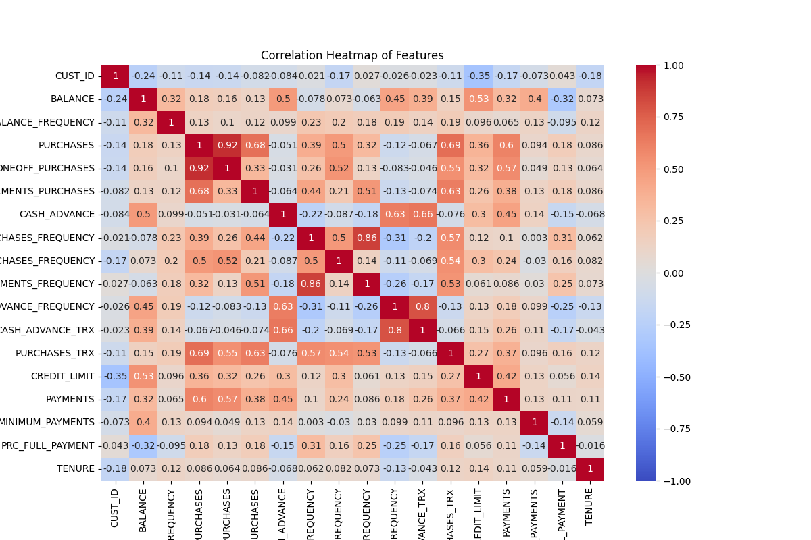
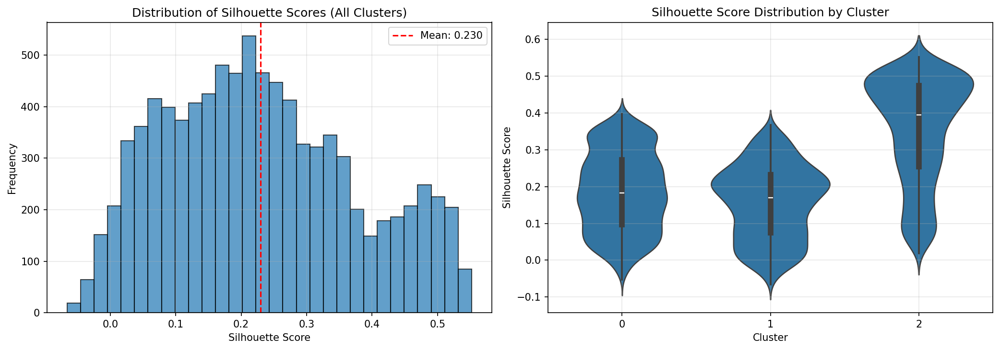

# K-Means Customer Segmentation — CC GENERAL

## Goal

- Learn K-Means end-to-end on the classic **Credit Card Dataset for Clustering (CC GENERAL)**, 
  selecting k with **Silhouette**, **Calinski–Harabasz (CH)**, and **Davies–Bouldin (DB)**,
  validating stability, and producing manager-friendly cluster profiles.

## Data

- Kaggle: **Credit Card Dataset for Clustering (CC GENERAL)** by Arjun Bhasin.
  File: `CC GENERAL.csv` (29k rows, 18 numeric features; anonymized credit-card usage).
- **Status**: ✅ Data downloaded and available in `data/raw/CC GENERAL.csv` (0.86 MB)

## Why this dataset

- Clean numeric features, strong real-world segmentation signal (spend, payments, balances).

## Project Structure

```
kmeans-cc-general-segmentation/
├── data/
│   ├── raw/               # CC GENERAL.csv (downloaded)
│   └── interim/           # Processed data
├── artifacts/
│   ├── models/            # Saved KMeans models
│   └── reports/           # Visualizations and briefs
├── notebooks/
│   ├── 00_get_data.ipynb          ✅ Complete
│   ├── 01_eda_preprocess.ipynb    ✅ Complete
│   ├── 02_k_selection_silhouette_ch_db.ipynb    ✅ Complete
│   ├── 03_fit_kmeans_and_profile.ipynb    ✅ Complete
│   ├── 04_stability_and_minibatch.ipynb
│   └── 05_pca_visualize_and_brief.ipynb
├── src/                   # Utility modules
└── tests/                 # Test plans
```

## Deliverables

- ✅ **Notebook 00**: Data download from Kaggle (complete)
- ✅ **Notebook 01**: EDA and preprocessing (complete)
- ✅ **Notebook 02**: k selection with elbow, Silhouette, CH, DB + majority vote (complete)
- ✅ **Notebook 03**: trained KMeans model, labeled dataset, profiles (size, spend, z-score radar) (complete)
- **Notebook 04**: stability (bootstrapped ARI/Jaccard), MiniBatchKMeans speed/quality comparison
- **Notebook 05**: PCA/UMAP 2D plots and a one-page brief in `artifacts/reports/`

## Preprocessing Results (Notebook 01)

### Data Cleaning Pipeline
1. **Outlier Clipping**: Winsorized at 1st and 99th percentiles
2. **Log Transformation**: Applied `log1p()` to all numeric features to handle right-skewed distributions
3. **Missing Value Imputation**: Median imputation for all features

### Key Findings

**Skewness Reduction** (critical for K-Means clustering):
- **MINIMUM_PAYMENTS**: 13.62 → 0.36 (97% reduction) ✅
- **PURCHASES**: 8.14 → -0.78 (excellent improvement) ✅
- **ONEOFF_PAYMENTS**: 10.05 → 0.18 (98% reduction) ✅

**Skewness Interpretation**:
- **Before cleaning**: Multiple features with extreme skewness (>5.0), making them unsuitable for K-Means
- **After cleaning**: All features now have skewness between -1.0 and +1.0, with most in the excellent range (-0.5 to +0.5)
- **Result**: Data is now well-suited for K-Means clustering, which assumes spherical clusters

**Missing Values**:
- `MINIMUM_PAYMENTS`: Most missing values (>3% of dataset)
- All missing values handled via median imputation after transformation

### Quality Checks
- ✅ No missing values remain after cleaning
- ✅ All features have acceptable skewness for clustering
- ✅ Data standardized and ready for K-Means

### Correlation Analysis

The correlation heatmap reveals important relationships between features that inform clustering decisions:

**Strong Positive Correlations** (indicating feature groups):
- **Purchase-related features**: `PURCHASES`, `ONEOFF_PURCHASES`, `INSTALLMENTS_PURCHASES`, `PURCHASES_FREQUENCY`, and `PURCHASES_TRX` are highly correlated (0.8-0.9), suggesting customers who engage in one type of purchase behavior tend to engage in others.
- **Cash Advance features**: `CASH_ADVANCE`, `CASH_ADVANCE_FREQUENCY`, and `CASH_ADVANCE_TRX` show strong positive correlations (0.7-0.8), indicating a distinct customer segment.
- **Balance and Credit**: `BALANCE` and `CREDIT_LIMIT` correlate at 0.53, showing that higher credit limits often correspond to higher outstanding balances.

**Weak/Negative Correlations** (indicating distinct segments):
- **Cash Advance vs. Purchases**: Weak negative correlation (-0.05) suggests customers who use cash advances are a different segment from frequent purchasers.
- **Payment behavior**: `PRC_FULL_PAYMENT` shows negative correlation with `BALANCE` (-0.32), indicating customers who pay in full tend to have lower balances.

**Clustering Implications**:
- High correlations suggest potential redundancy, which could benefit from dimensionality reduction (PCA) in future iterations.
- Distinct correlation blocks (purchase-related vs. cash advance-related) hint at natural customer segments that K-Means should discover.

<div align="center">



*Correlation heatmap showing relationships between 18 credit card usage features*

</div>

## K Selection Results (Notebook 02)

### Optimal k: **3 clusters**

We evaluated k values from 2 to 12 using four complementary metrics:

**Metrics Used:**
1. **Inertia (WCSS)**: Measures cluster compactness - look for the "elbow"
2. **Silhouette Score**: Measures how well points fit their clusters (range: -1 to +1, higher is better)
3. **Calinski-Harabasz Score**: Measures separation-to-compactness ratio (higher is better)
4. **Davies-Bouldin Score**: Measures cluster distinctness (lower is better)

**Results Summary:**
- **k=2**: Highest Silhouette (0.26) and Calinski-Harabasz (3,200), but high inertia
- **k=3**: ✅ **Optimal choice** - Best Davies-Bouldin (1.66), strong Silhouette (0.23), clear inertia elbow
- **k=6**: Local peak in Silhouette (0.23)
- **k=8**: Worst Davies-Bouldin score (1.40), indicating overlapping clusters

**Majority Vote Decision:**
- ✅ Inertia: Elbow at k=3
- ✅ Silhouette: Strong at k=3 (0.23)
- ✅ Calinski-Harabasz: High at k=3 (2,700)
- ✅ Davies-Bouldin: **Best at k=3** (1.66)

**Business Interpretation:**
With k=3, we expect to discover three distinct customer segments:
1. **High-value customers**: High purchases and payments
2. **Cash advance users**: Different spending behavior pattern
3. **Low-activity customers**: Minimal credit card usage

<div align="center">


*Four metrics evaluated across k=2 to k=12: Inertia (elbow method), Silhouette Score, Calinski-Harabasz Score, and Davies-Bouldin Score (inverted)*

</div>

**Detailed Explanation**: See `artifacts/reports/k_selection_metrics_explanation.md` for a comprehensive guide to understanding each metric.

## Cluster Profiles and Analysis (Notebook 03)

### Final Model: K-Means with k=3

**Model Status:**
- ✅ Model trained and saved to `artifacts/models/kmeans.joblib`
- ✅ All 8,950 customers labeled with cluster assignments
- ✅ Cluster sizes: Balanced distribution (32-36% each)

### Discovered Customer Segments

**Cluster 0: "High-Value Active Spenders" (3,218 customers - 36%)**
- Highest purchase activity (z-score: +0.81)
- High one-off purchases (z-score: +0.82)
- Above-average balances and payments
- **Strategy**: Premium rewards, credit limit increases
- **Risk**: Medium - monitor for over-extension

**Cluster 1: "Low-Balance Full Payers" (2,897 customers - 32%)**
- Lowest balances (z-score: -1.02)
- Highest full payment rate (z-score: +0.41)
- Low minimum payments (z-score: -0.77)
- **Strategy**: Encourage usage with rewards, respect conservative behavior
- **Risk**: Low - responsible users

**Cluster 2: "High-Balance Low Spenders" (2,835 customers - 32%)**
- Highest balances (z-score: +0.54)
- Lowest purchases (z-score: -1.16)
- Rarely pays in full (z-score: -0.42)
- **Strategy**: ⚠️ **Priority risk management** - debt assistance, payment plans
- **Risk**: **High** - potential default risk

### Cluster Quality Validation

**Silhouette Score Analysis:**
- **Overall Mean**: 0.230 (moderate clustering quality)
- **Cluster 0**: 0.186 (moderate distinctness)
- **Cluster 1**: 0.157 (most fragile - least distinct)
- **Cluster 2**: 0.354 (most cohesive - well-separated)

**Interpretation:**
- Cluster 2 is the most well-defined segment (high-risk customers with clear behavior pattern)
- Cluster 1 is the most fragile, suggesting it may contain sub-segments that could benefit from further segmentation
- Overall clustering quality is acceptable for business decision-making

<div align="center">



*Silhouette score distributions: Overall histogram (left) and per-cluster violin plots (right). Cluster 2 shows highest cohesion (0.354), while Cluster 1 is most fragile (0.157).*

</div>

**Detailed Cluster Analysis**: See `artifacts/reports/cluster_profiles_analysis.md` for comprehensive business insights and actionable strategies for each segment.

## How to run

1) `pip install -r requirements.txt`

2) ✅ Data is already downloaded in `data/raw/CC GENERAL.csv` (via Notebook 00)

3) Execute notebooks 01 → 05 in order.

